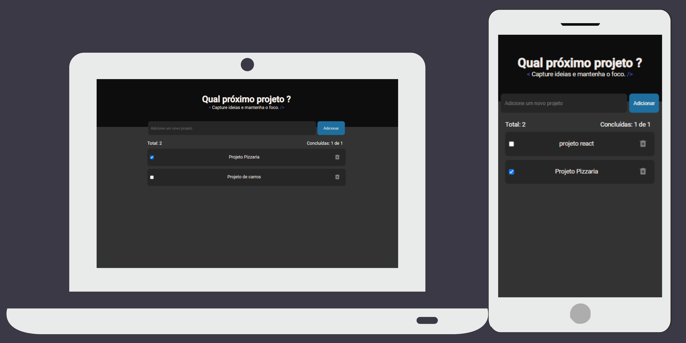

# Anotações de projeto

Uma aplicação que permite aos usuários adicionar projetos em andamento, marcar quando um projeto foi concluído, excluir e armazenar informações no localStorage para fácil acesso e gerenciamento dos projetos.

Essa aplicação seria útil para indivíduos que deseja acompanhar e gerenciar projetos de forma simples e eficaz. Ela oferece funcionalidades básicas para o controle de projetos e tarefas, com a conveniência de armazenamento local.

<h1>
         
</h1>

Deploy: <a href="https://anota-pensamento-front-2t2k.vercel.app/"> - Clique aqui </a>

## Funcionabilidade

- Adicionar projetos  em andamento
- Marcar quando projeto já foi concluído.
- Deletar tarefa
- Armazenamento no localStorage

